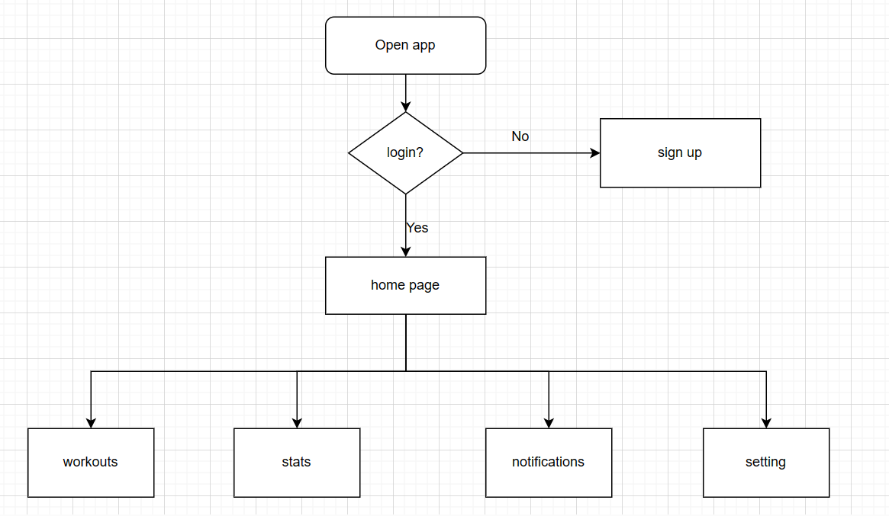
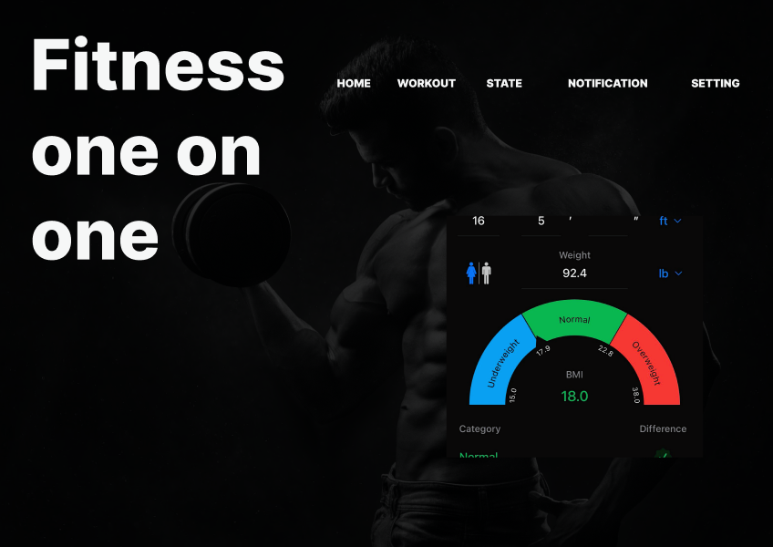

# **FINAL ALX iSWE PROJECT**

## **Project Overview:**

**Project name:** Fitness one on one

**Purpose and goals:** 

The purpose of this this app is to help users keep track of their workouts, IBM, and fitness journey. the main goal of our app is to provide the user with instructions and examples of one or more types of exercise and physical activity. 

## **Features and Functionality:**

**Running feature:**

**BMI Calculator:**

BMI calculates body fat based on height and weight that applies to adult men and women.

**Water tracker:**

The water tracker is used to notify users when to drink water. 

**Workout videos:**

Daily personalized workout videos to help our users meet their goal weight.

**Sleep tracker:**

The sleep tracker is used to moniter various sleep aspects ncluding the amount of time you are sleeping and how many times your sleep is disrupted each night.

**Achievement tracker:**

keeps track of the users progress.

## **Technologies used:**

-htm
-css
-Javascript

## **Screenshots or Demo:**

## **Roadmap and future enhancements:**

**1.Customized diet plans:**

A eating plan that is customized to the users weight goal. 

**2.link your wearable devices :**

In the future youwill be able to link other devices to this application.

## **Contact information:**

Name: Phindile Ayanda Sibiya

Email: phindileayandasibiya6@gmail.com

twitter Username:  Phindileayanda7

LinkedIn URL: https://www.linkedin.com/in/phindile-sibiya-15676114b/
